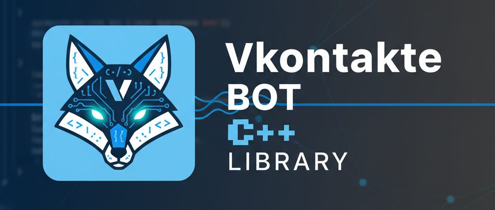

<p align="center">
  
</p>


# VKBOT (boost-based)

 Переработка оригинальной библиотеки [qucals/VKAPI](https://github.com/qucals/VK-API). Убраны все сырые указатели и CURL,
транспортный слой переведён на **Boost.Beast + Boost.Asio**.

## Сборка с примерами через Conan + CMake

```bash
# 1. Установить зависимости
conan install . --output-folder=build --build=missing -s build_type=Release

# 2. Сконфигурировать
cmake -B build -DCMAKE_BUILD_TYPE=Release \
      -DCMAKE_TOOLCHAIN_FILE=build/conan_toolchain.cmake

# 3. Собрать
cmake --build build --config Release -j$(nproc)

# 4. Установить (опционально)
cmake --install build --prefix /usr/local
```

## Быстрый старт — бот

```cpp
#include <vkbot/BotBase.hpp>

vk::bot::BotBase bot("your_group_id");
bot.auth("your_token");

while (true) {
    auto [type, payload] = bot.wait_for_event();
    if (type == vk::bot::BotBase::Event::MessageNew) {
        // обработка
    }
}
```

## Быстрый старт — пользователь

```cpp
#include <vkbot/UserBase.hpp>

vk::user::UserBase user("app_id", "app_secret");
user.auth("access_token");

auto resp = user.send_request(vk::user::UserBase::Method::UsersGet, {});
```

## Асинхронные запросы (бот)

```cpp
auto future = bot.send_request_async(
    vk::bot::BotBase::Method::SendMessage,
    {{"peer_id", "123"}, {"message", "hello"}, {"random_id", "0"}}
);
auto result = future.get();
```

## ✍️ Авторы

- [@qucals](https://github.com/qucals) - Idea & Initial work

- [@jetfire27](https://github.com/jetfire-oldsmobile27) - Bugfix & Refactor & Rewrite to boost libs & conan deployment
